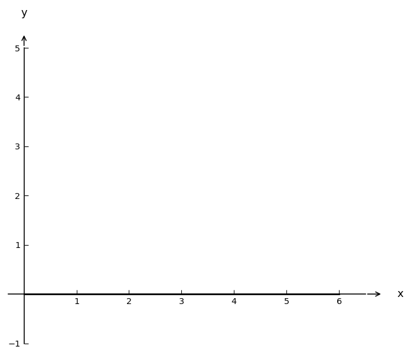

# Exam Question — MATH / Level A

| Field | Value |
|---|---|
| **ID** | `54586030-cc7e-4f6a-bb3b-4e9ec8ebbed9` |
| **Subject** | math |
| **Level** | A |
| **Format** | image |
| **Topic** | inequalities |
| **Generated** | 2026-04-23T10:10:28.681385+00:00 |
| **Attempts** | 3 |

## Figure

## Question

Берілген суреттегі $f(x)$ функциясының графигіне қарап, теңсіздіктің шешімін табыңыз: $f(x) > 0$.

## Options

- **A)** (2, 5) ✓
- **B)** (-1, 4)
- **C)** (0, 3)
- **D)** (4, 6)

## Correct Answer

**A**

## Explanation

Суреттегі $f(x)$ функциясының графигіне қарағанда, функция $x = 2$ мен $x = 5$ аралығында 0-ден жоғары мәндер қабылдайды. Осылайша, $f(x) > 0$ теңсіздігінің шешімі $x \in (2, 5)$ аралығы.

## Key Formulas

$$
f(x) > 0
$$

## Critic Evaluation

**Overall score:** 9.4/10 — PASS

| Dimension | Score |
|---|---|
| Correctness | 10.0/10 |
| Distractor quality | 8.0/10 |
| Difficulty alignment | 10.0/10 |
| Kazakh language | 9.0/10 |
| LaTeX validity | 10.0/10 |
| Figure relevance | 10.0/10 |

**Comments:** The question is well-constructed with a clear correct answer and plausible distractors. The difficulty level is appropriate for basic recall and application of graph analysis. The Kazakh language is mostly correct, and the LaTeX is properly formatted.

### Critic's Independent Solution

To solve the inequality $f(x) > 0$ using the graph of the function $f(x)$, we need to identify the intervals where the graph of $f(x)$ is above the x-axis. This is because $f(x) > 0$ indicates that the function values are positive, which corresponds to the graph being above the x-axis.

Looking at the graph, we observe the following:
- The graph is above the x-axis between the x-values 2 and 5. This means that for $x$ in the interval (2, 5), the function $f(x)$ is positive.
- Outside this interval, the graph is either on or below the x-axis, which means $f(x) \leq 0$.

Therefore, the solution to the inequality $f(x) > 0$ is the interval (2, 5).

Checking the options provided:
A) (2, 5) - This matches the interval where $f(x) > 0$.
B) (-1, 4) - This interval includes parts where the graph is below the x-axis.
C) (0, 3) - This interval includes parts where the graph is below the x-axis.
D) (4, 6) - This interval includes parts where the graph is below the x-axis.

Thus, the correct answer is option A.

**Critic's answer:** A
