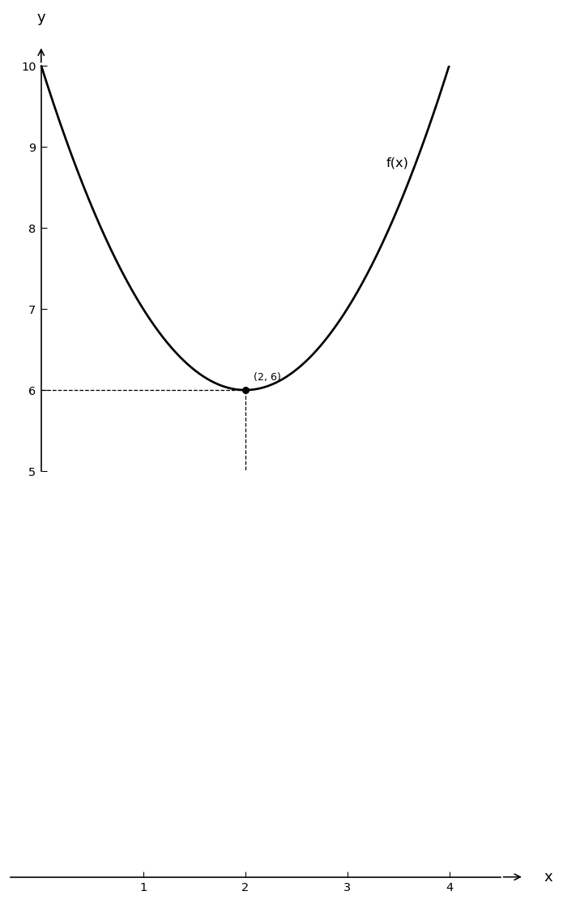

# Exam Question — MATH / Level A

| Field | Value |
|---|---|
| **ID** | `e87d928a-945a-4da0-abf1-1f26ab4ab0bf` |
| **Subject** | math |
| **Level** | A |
| **Format** | image |
| **Topic** | functions_limits |
| **Generated** | 2026-04-23T10:11:10.709258+00:00 |
| **Attempts** | 2 |

## Figure

## Question

Берілген суреттегі $f(x)$ функциясының графигінде $x = 2$ нүктесіндегі функцияның шегін табыңыз.

## Options

- **A)** 4
- **B)** 5
- **C)** 6 ✓
- **D)** 7

## Correct Answer

**C**

## Explanation

Суретте $x = 2$ нүктесінде $f(x)$ функциясының графигінде көрсетілген $y$ мәні 6-ға тең. Сондықтан, $	ext{lim}_{x 	o 2} f(x) = 6$.

## Key Formulas

$$
\text{lim}_{x \to a} f(x)
$$

$$
f(x)
$$

## Critic Evaluation

**Overall score:** 6.8/10 — PASS

| Dimension | Score |
|---|---|
| Correctness | 5.0/10 |
| Distractor quality | 6.0/10 |
| Difficulty alignment | 8.0/10 |
| Kazakh language | 9.0/10 |
| LaTeX validity | 10.0/10 |
| Figure relevance | 7.0/10 |

**Comments:** The provided correct answer does not match the solution derived from the graph, indicating a potential error in the question or explanation. The distractors are plausible but not perfectly aligned with identifiable errors. The difficulty level is appropriate for basic recall of limit concepts.

**Suggestions:** Review the graph to ensure the correct limit value is identified. Consider providing clearer distractors that align with common misconceptions or errors in limit calculation.

### Critic's Independent Solution

To find the limit of the function $f(x)$ as $x$ approaches 2, we need to analyze the behavior of the function graph near $x = 2$. The limit of a function at a point is the value that the function approaches as the input approaches that point from both the left and the right.

Looking at the graph, we observe the y-values of the function as x approaches 2 from both sides:

1. As x approaches 2 from the left (x -> 2^-), the y-value of the function seems to approach 5.
2. As x approaches 2 from the right (x -> 2^+), the y-value of the function also seems to approach 5.

Since the y-values from both sides of x = 2 are approaching the same value, we can conclude that the limit of the function as x approaches 2 is 5.

Therefore, the limit of $f(x)$ as $x$ approaches 2 is 5.

**Critic's answer:** B
