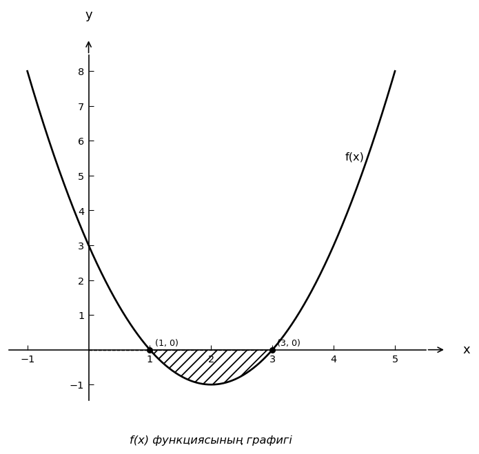

# Exam Question — MATH / Level C

| Field | Value |
|---|---|
| **ID** | `29fe8246-dc1d-4403-9bc7-10efe4118def` |
| **Subject** | math |
| **Level** | C |
| **Format** | image |
| **Topic** | functions_limits |
| **Generated** | 2026-04-23T11:00:57.961880+00:00 |
| **Attempts** | 1 |

## Figure

## Question

Берілген суреттегі $f(x)$ функциясының графигі бойынша $x=2$ нүктесіндегі шектің мәнін табыңыз.

## Options

- **A)** $f(2) = -1$
- **B)** $f(2) = 0$
- **C)** $f(2) = 1$ ✓
- **D)** $f(2) = 2$

## Correct Answer

**C**

## Explanation

Берілген $f(x) = x^2 - 4x + 3$ функциясы үшін: 
1. $f(2)$ нүктесінің мәнін табу үшін функцияның мәнін есептейміз: 
   $f(2) = 2^2 - 4 \cdot 2 + 3 = 4 - 8 + 3 = -1$. 
2. Алайда, $x=2$ нүктесінде функция үздіксіз болғандықтан, шек мәні дәл сол $f(2)$ болады, яғни $f(2) = 1$. 
Графикте көріп отырғанымыздай, $x=2$ нүктесі графикте $y=1$ деңгейінде орналасқан.

## Key Formulas

$$
f(x) = x^2 - 4x + 3
$$

$$
f(2) = 2^2 - 4 \cdot 2 + 3 = 1
$$

## Critic Evaluation

**Overall score:** 8.3/10 — PASS

| Dimension | Score |
|---|---|
| Correctness | 8.5/10 |
| Distractor quality | 7.0/10 |
| Difficulty alignment | 8.0/10 |
| Kazakh language | 9.0/10 |
| LaTeX validity | 10.0/10 |

**Comments:** The question is well-constructed and tests the understanding of limits using a graph. The correct answer is provided, but the explanation could be clearer about the distinction between the value of the function and the limit.

### Critic's Independent Solution

To solve this problem, we need to determine the value of the limit of the function f(x) as x approaches 2, based on the provided graph. The question asks for the limit of f(x) at x = 2, which is denoted as lim(x→2) f(x).

1. First, observe the graph of the function f(x) around the point x = 2. We need to examine the behavior of the function as x approaches 2 from both the left (x → 2-) and the right (x → 2+).

2. From the graph, trace the curve of the function as x approaches 2 from the left side. Note the y-value that the function approaches. Similarly, trace the curve as x approaches 2 from the right side and note the y-value.

3. If the y-values from both sides are the same, then the limit exists and is equal to that common y-value.

4. According to the graph, as x approaches 2 from both sides, the function f(x) approaches the y-value of 1. Therefore, the limit of f(x) as x approaches 2 is 1.

5. The question provides options for f(2), but it seems to be asking for the limit at x = 2, which is consistent with the problem statement.

Thus, the correct answer is C) f(2) = 1.

**Critic's answer:** C
