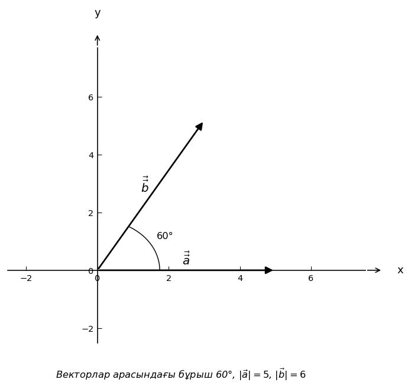

# Exam Question — MATH / Level A

| Field | Value |
|---|---|
| **ID** | `b45c7242-5ae9-4a04-841a-c0569eee299f` |
| **Subject** | math |
| **Level** | A |
| **Format** | image |
| **Topic** | vectors |
| **Generated** | 2026-06-02T19:23:57.143863+00:00 |
| **Attempts** | 1 |

## Figure

## Question

Суреттегі $\vec{a}$ және $\vec{b}$ векторларының скалярлық көбейтіндісін $\vec{a} \cdot \vec{b}$ табыңыз.

## Options

- **A)** $15$ ✓
- **B)** $15\sqrt{3}$
- **C)** $\frac{15\sqrt{3}}{2}$
- **D)** $\frac{15}{2}$

## Correct Answer

**A**

## Explanation

Скалярлық көбейтінді формуласы: $\vec{a} \cdot \vec{b} = |\vec{a}| \cdot |\vec{b}| \cdot \cos\theta$. Суреттен: $|\vec{a}| = 5$, $|\vec{b}| = 6$, $\theta = 60°$. Онда: $\vec{a} \cdot \vec{b} = 5 \cdot 6 \cdot \cos 60° = 30 \cdot \frac{1}{2} = 15$.

## Key Formulas

$$
\vec{a} \cdot \vec{b} = |\vec{a}| \cdot |\vec{b}| \cdot \cos\theta
$$

$$
\cos 60° = \frac{1}{2}
$$

## Critic Evaluation

**Overall score:** 9.6/10 — PASS

| Dimension | Score |
|---|---|
| Correctness | 10.0/10 |
| Distractor quality | 8.667/10 |
| Difficulty alignment | 10.0/10 |
| Kazakh language | 9.667/10 |
| LaTeX validity | 9.667/10 |
| Figure relevance | 9.667/10 |

**Comments:** [openai/gpt-5.5] The item is mathematically correct and has a single clear answer using the standard dot product formula with the given magnitudes and 60° angle. It aligns well with level A; the figure and Kazakh wording are clear. | [anthropic/claude-sonnet-4.6] The question is well-constructed, factually correct, and perfectly aligned with Level A difficulty. The dot product formula is applied in a single step, the figure clearly shows the angle and magnitudes, and all distractors correspond to identifiable errors (e.g., using sin instead of cos, forgetting the 1/2 factor, or using √3/2 instead of 1/2). | [google/gemini-3.1-pro-preview] The question perfectly aligns with Level A difficulty, requiring a direct application of the scalar product formula. The distractors are exceptionally well-crafted, anticipating common student errors such as confusing the dot product with the cross product magnitude or the triangle area formula.

### Critic's Independent Solution

[openai/gpt-5.5] answered A: The scalar product of two vectors is given by a · b = |a||b|cos(theta), where theta is the angle between them. From the figure/text, the angle between the vectors is theta = 60°, |a| = 5, and |b| = 6. Therefore, a · b = 5 · 6 · cos(60°) = 30 · 1/2 = 15. So the correct option is A.

[anthropic/claude-sonnet-4.6] answered A: The dot product formula is: a·b = |a| × |b| × cos(θ), where θ is the angle between the vectors. Given: |a| = 5, |b| = 6, θ = 60°. Therefore: a·b = 5 × 6 × cos(60°) = 30 × (1/2) = 15.

[google/gemini-3.1-pro-preview] answered A: To find the scalar (dot) product of two vectors, we use the formula: $\vec{a} \cdot \vec{b} = |\vec{a}| \cdot |\vec{b}| \cdot \cos(\theta)$, where $|\vec{a}|$ and $|\vec{b}|$ are the magnitudes of the vectors, and $\theta$ is the angle between them. 

From the text at the bottom of the image, we are given:
- The magnitude of vector $\vec{a}$, $|\vec{a}| = 5$
- The magnitude of vector $\vec{b}$, $|

**Critic's answer:** A
