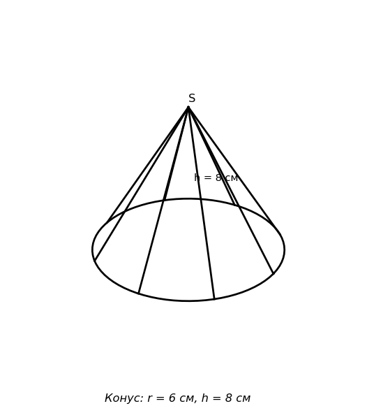

# Exam Question — MATH / Level B

| Field | Value |
|---|---|
| **ID** | `c83d78d3-ac1d-4b88-97c8-7b818bc1d43f` |
| **Subject** | math |
| **Level** | B |
| **Format** | image |
| **Topic** | solids_of_revolution |
| **Generated** | 2026-06-02T19:27:14.166506+00:00 |
| **Attempts** | 3 |

## Figure

## Question

Суреттегі конустың бүйір беті мен негізінің ауданының қосындысы неге тең?

## Options

- **A)** $96\pi$ см² ✓
- **B)** $80\pi$ см²
- **C)** $60\pi$ см²
- **D)** $48\pi$ см²

## Correct Answer

**A**

## Explanation

Суреттен: конустың негізінің радиусы $r = 6$ см, биіктігі $h = 8$ см.

**1-қадам:** Жасаушының ұзындығын табамыз:
$$l = \sqrt{r^2 + h^2} = \sqrt{6^2 + 8^2} = \sqrt{36 + 64} = \sqrt{100} = 10 \text{ см}$$

**2-қадам:** Бүйір бетінің ауданы:
$$S_{\text{бүйір}} = \pi r l = \pi \cdot 6 \cdot 10 = 60\pi \text{ см}^2$$

**3-қадам:** Негізінің ауданы:
$$S_{\text{негіз}} = \pi r^2 = \pi \cdot 6^2 = 36\pi \text{ см}^2$$

**4-қадам:** Толық беті:
$$S_{\text{толық}} = S_{\text{бүйір}} + S_{\text{негіз}} = 60\pi + 36\pi = 96\pi \text{ см}^2$$

## Key Formulas

$$
l = \sqrt{r^2 + h^2}
$$

$$
S_{\text{бүйір}} = \pi r l
$$

$$
S_{\text{толық}} = \pi r l + \pi r^2
$$

## Critic Evaluation

**Overall score:** 9.1/10 — PASS

| Dimension | Score |
|---|---|
| Correctness | 10.0/10 |
| Distractor quality | 8.333/10 |
| Difficulty alignment | 8.833/10 |
| Kazakh language | 8.5/10 |
| LaTeX validity | 10.0/10 |
| Figure relevance | 8.333/10 |

**Comments:** [openai/gpt-5.5] The keyed answer is correct and the solution is unambiguous: using r = 6 and h = 8 gives slant height 10 and total surface area 96π. The item fits medium difficulty reasonably well, though the figure/caption could label the radius more clearly and some distractors are only moderately plausible. | [anthropic/claude-sonnet-4.6] The question is mathematically correct, well-structured, and requires 4 logical steps (find slant height, lateral area, base area, sum) consistent with level B. Distractors correspond to identifiable errors: C (60π) = lateral surface only, D (48π) = plausible miscalculation, B (80π) = less obvious but reachable. The figure shows the cone with h=8 labeled inside and the caption gives r=6, h=8, making the figure somewhat redundant with the caption text. | [google/gemini-3.1-pro-preview] The question is well-structured, accurate, and perfectly aligns with the requested difficulty level. Distractors represent common student errors.

**Suggestions:** [anthropic/claude-sonnet-4.6] The figure caption 'Конус: r = 6 см, h = 8 см' already provides all needed data, making the figure partly redundant. Consider labeling r directly on the figure (showing the radius line) to make the figure more essential. Also, distractor B (80π) could be made more pedagogically motivated by tying it to a specific common error. | [google/gemini-3.1-pro-preview] Consider using 'аудандарының қосындысы' instead of 'ауданының қосындысы' for better grammatical precision.

### Critic's Independent Solution

[openai/gpt-5.5] answered A: For a right circular cone, the sum of the lateral surface area and the base area is the total surface area: S = pi*r*l + pi*r^2, where r is the radius and l is the slant height. From the figure/text, r = 6 cm and h = 8 cm. The slant height is found by the Pythagorean theorem: l = sqrt(r^2 + h^2) = sqrt(6^2 + 8^2) = sqrt(36 + 64) = sqrt(100) = 10 cm. Lateral area = pi*r*l = pi*6*10 = 60pi cm^2. Bas

[anthropic/claude-sonnet-4.6] answered A: Given: cone with radius r = 6 cm and height h = 8 cm.

Step 1: Find the slant height (l).
l = √(r² + h²) = √(36 + 64) = √100 = 10 cm

Step 2: Calculate the lateral surface area.
Lateral surface area = π·r·l = π × 6 × 10 = 60π cm²

Step 3: Calculate the base area.
Base area = π·r² = π × 36 = 36π cm²

Step 4: Sum of lateral surface area and base area.
Total = 60π + 36π = 96π cm²

The answer is 96π c

[google/gemini-3.1-pro-preview] answered A: The question asks for the sum of the lateral surface area and the base area of the cone, which is its total surface area. From the image, we are given the base radius $r = 6$ cm and the height $h = 8$ cm. First, we need to find the slant height $l$ of the cone using the Pythagorean theorem: $l = \sqrt{r^2 + h^2} = \sqrt{6^2 + 8^2} = \sqrt{36 + 64} = \sqrt{100} = 10$ cm. Next, we calculate the late

**Critic's answer:** A
