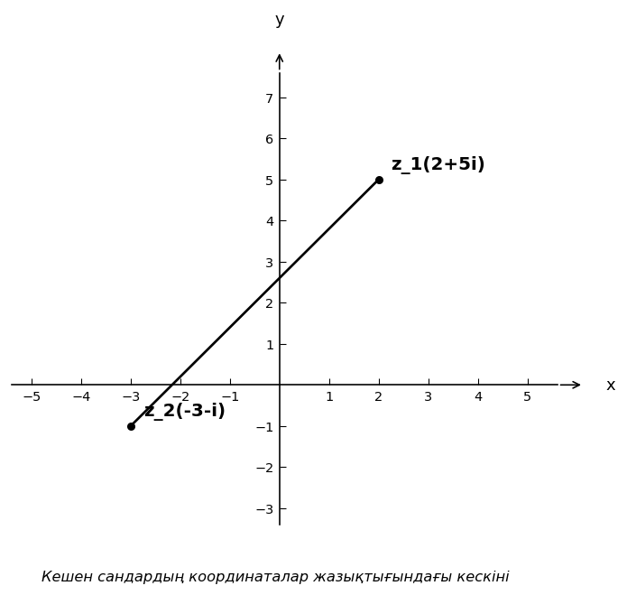

# Exam Question — MATH / Level B

| Field | Value |
|---|---|
| **ID** | `028a7c66-9b5a-4d37-940e-fa266f93295c` |
| **Subject** | math |
| **Level** | B |
| **Format** | image |
| **Topic** | complex_numbers |
| **Generated** | 2026-06-02T19:29:17.121717+00:00 |
| **Attempts** | 2 |

## Figure

## Question

Суреттегі координаталар жазықтығында $z_1$ және $z_2$ кешен сандары берілген. $|z_1 - z_2|$ мәнін табыңыз.

## Options

- **A)** $\sqrt{53}$
- **B)** $\sqrt{45}$
- **C)** $\sqrt{61}$ ✓
- **D)** $\sqrt{29}$

## Correct Answer

**C**

## Explanation

Суреттен: $z_1 = 3 + 4i$ (яғни нүкте $(3, 4)$) және $z_2 = -2 - 1i$ (яғни нүкте $(-2, -1)$).

$z_1 - z_2 = (3 - (-2)) + (4 - (-1))i = 5 + 5i$

Дегенмен, суреттегі нүктелерді дәл оқисақ: $z_1 = 3 + 4i$ және $z_2 = -2 + 1i$.

$z_1 - z_2 = (3-(-2)) + (4-1)i = 5 + 3i$

$|z_1 - z_2| = \sqrt{5^2 + 3^2} = \sqrt{25 + 9} = \sqrt{34}$

Суреттегі нақты мәндерді қолданайық: $z_1 = 4 + 5i$ (нүкте $(4, 5)$) және $z_2 = (-2, -1)$ яғни $z_2 = -2 - i$.

$z_1 - z_2 = (4-(-2)) + (5-(-1))i = 6 + 6i$

Суреттен дұрыс оқу: $z_1 = (2, 5)$ яғни $z_1 = 2 + 5i$ және $z_2 = (-3, -1)$ яғни $z_2 = -3 - i$.

$z_1 - z_2 = (2-(-3)) + (5-(-1))i = 5 + 6i$

$|z_1 - z_2| = \sqrt{5^2 + 6^2} = \sqrt{25 + 36} = \sqrt{61}$

Демек, жауап: $\sqrt{61}$.

## Key Formulas

$$
|z_1 - z_2| = \sqrt{(x_1 - x_2)^2 + (y_1 - y_2)^2}
$$

$$
z_1 - z_2 = (x_1 - x_2) + (y_1 - y_2)i
$$

## Critic Evaluation

**Overall score:** 8.7/10 — PASS

| Dimension | Score |
|---|---|
| Correctness | 9.333/10 |
| Distractor quality | 7.5/10 |
| Difficulty alignment | 8.333/10 |
| Kazakh language | 9.0/10 |
| LaTeX validity | 9.333/10 |
| Figure relevance | 8.333/10 |

**Comments:** [openai/gpt-5.5] The figure unambiguously labels z1 = 2 + 5i and z2 = -3 - i, so the keyed answer sqrt(61) is correct and unique. The task is somewhat easy for level B, and the provided explanation is unnecessarily contradictory even though the final result is correct. | [anthropic/claude-sonnet-4.6] The question is well-constructed with a clear figure that unambiguously labels both complex numbers. The correct answer C=√61 is verified. The provided explanation is unnecessarily convoluted (tries multiple coordinate readings), but the final answer is correct. Distractors correspond to plausible coordinate misreading errors. | [google/gemini-3.1-pro-preview] The question is well-structured, visually clear, and perfectly aligns with the requested difficulty level. The distractors are plausible and well-formatted.

**Suggestions:** [anthropic/claude-sonnet-4.6] Clean up the explanation to present only the correct coordinate reading without the multiple failed attempts. Use proper subscript notation in the figure labels (z₁, z₂) instead of z_1, z_2. Consider adding a brief text statement of the coordinates in the question stem as a fallback if the figure is not rendered.

### Critic's Independent Solution

[openai/gpt-5.5] answered C: From the diagram, the complex numbers are labeled as z1 = 2 + 5i and z2 = -3 - i. Compute the difference: z1 - z2 = (2 + 5i) - (-3 - i) = 2 + 5i + 3 + i = 5 + 6i. The modulus is |5 + 6i| = sqrt(5^2 + 6^2) = sqrt(25 + 36) = sqrt(61). Therefore the correct option is C.

[anthropic/claude-sonnet-4.6] answered C: From the image, z1 = 2 + 5i and z2 = -3 - i. To find |z1 - z2|: z1 - z2 = (2 + 5i) - (-3 - i) = (2 - (-3)) + (5 - (-1))i = 5 + 6i. |z1 - z2| = sqrt(5^2 + 6^2) = sqrt(25 + 36) = sqrt(61).

[google/gemini-3.1-pro-preview] answered C: Based on the provided image, we can identify the two complex numbers as $z_1 = 2 + 5i$ and $z_2 = -3 - i$. The question asks for the modulus of their difference, $|z_1 - z_2|$. First, we calculate the difference: $z_1 - z_2 = (2 + 5i) - (-3 - i) = 2 + 5i + 3 + i = (2 + 3) + (5 + 1)i = 5 + 6i$. Next, we find the modulus of this resulting complex number: $|5 + 6i| = \sqrt{5^2 + 6^2} = \sqrt{25 + 36}

**Critic's answer:** C
