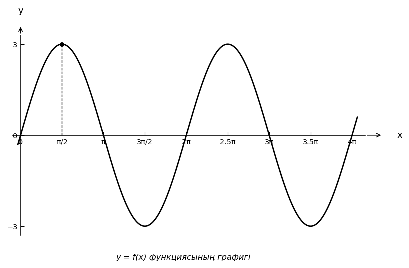

# Exam Question — MATH / Level A

| Field | Value |
|---|---|
| **ID** | `d9432510-3ba3-4877-88ce-20fcb4ffcf23` |
| **Subject** | math |
| **Level** | A |
| **Format** | image |
| **Topic** | trigonometry |
| **Generated** | 2026-06-02T18:17:59.033173+00:00 |
| **Attempts** | 1 |

## Figure

## Question

Суреттегі $y = f(x)$ тригонометриялық функциясының графигі бойынша оның амплитудасын табыңыз.

## Options

- **A)** $6$
- **B)** $2$
- **C)** $3$ ✓
- **D)** $1$

## Correct Answer

**C**

## Explanation

Тригонометриялық функцияның амплитудасы оның ең үлкен (максимум) және ең кіші (минимум) мәндерінің айырмасының жартысына тең, яғни $A = \frac{y_{\max} - y_{\min}}{2}$. Суреттегі графиктен функцияның ең үлкен мәні $y_{\max} = 3$, ал ең кіші мәні $y_{\min} = -3$ екенін көреміз. Сондықтан амплитуда $A = \frac{3 - (-3)}{2} = \frac{6}{2} = 3$. (Немесе тепе-теңдік осінен ең жоғарғы нүктесіне дейінгі тік қашықтықты тікелей графиктен көруге болады).

## Key Formulas

$$
A = \frac{y_{\max} - y_{\min}}{2}
$$

## Critic Evaluation

**Overall score:** 9.5/10 — PASS

| Dimension | Score |
|---|---|
| Correctness | 10.0/10 |
| Distractor quality | 8.333/10 |
| Difficulty alignment | 9.667/10 |
| Kazakh language | 9.5/10 |
| LaTeX validity | 9.667/10 |
| Figure relevance | 9.667/10 |

**Comments:** [openai/gpt-5.5] The keyed answer is correct: the graph has maximum 3 and minimum -3, so the amplitude is 3. The item is appropriate for level A and the figure clearly supports the task. | [anthropic/claude-sonnet-4.6] The question is well-constructed: the graph clearly shows max=3 and min=-3, making amplitude=3 unambiguous. Distractors are plausible — 6 (full range, forgetting to halve), 2 (possibly misreading the graph), 1 (unit confusion) — though distractor B=2 is slightly less motivated. | [google/gemini-3.1-pro-preview] The question is perfectly aligned with the requested difficulty level A. It tests a basic concept (amplitude) directly from a clear, well-labeled graph. The distractors represent common student errors, such as confusing amplitude with peak-to-peak distance or the standard amplitude of a sine wave.

### Critic's Independent Solution

[openai/gpt-5.5] answered C: From the graph, the maximum value of the trigonometric function is y = 3, and the minimum value is y = -3. The amplitude is half the distance between the maximum and minimum values: amplitude = (maximum - minimum) / 2 = (3 - (-3)) / 2 = 6 / 2 = 3. Therefore, the amplitude is 3.

[anthropic/claude-sonnet-4.6] answered C: From the graph, the maximum value of the function is 3 and the minimum value is -3. The amplitude of a trigonometric function is defined as half the difference between the maximum and minimum values, or equivalently the absolute value of the maximum (when the function is centered at zero). Amplitude = (max - min) / 2 = (3 - (-3)) / 2 = 6 / 2 = 3. The graph shows a sine-like function with peaks at 

[google/gemini-3.1-pro-preview] answered C: To find the amplitude of a trigonometric function from its graph, we need to determine the maximum and minimum values of the function. The amplitude is defined as half the distance between the maximum and minimum values: Amplitude = (y_max - y_min) / 2. Looking at the provided graph, the highest point (peak) is at y = 3, so y_max = 3. The lowest point (trough) is at y = -3, so y_min = -3. Plugging

**Critic's answer:** C
