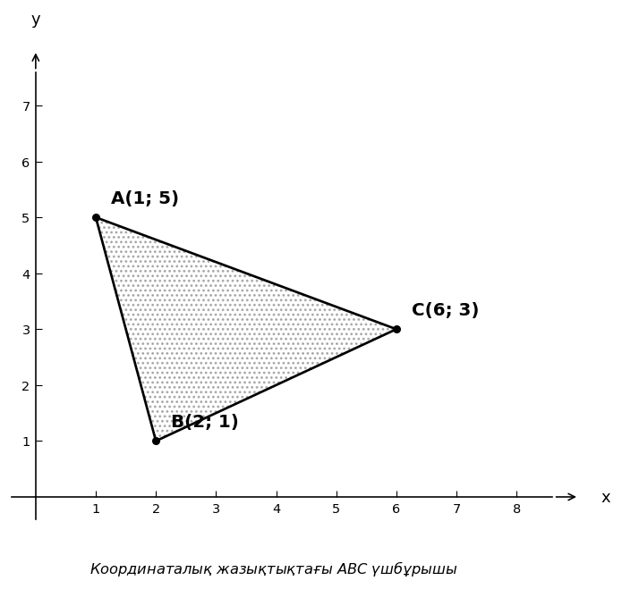

# Exam Question — MATH / Level B

| Field | Value |
|---|---|
| **ID** | `20bb0f4a-abc5-46c5-96fa-1ddb2a37cc11` |
| **Subject** | math |
| **Level** | B |
| **Format** | image |
| **Topic** | vectors |
| **Generated** | 2026-06-02T18:19:51.286911+00:00 |
| **Attempts** | 1 |

## Figure

## Question

Берілген суреттегі $ABC$ үшбұрышы үшін $M$ нүктесі $BC$ қабырғасының ортасы болып табылады. $\vec{AM}$ және $\vec{BC}$ векторларының скаляр көбейтіндісін табыңыз.

## Options

- **A)** $-6$
- **B)** $6$ ✓
- **C)** $18$
- **D)** $-4$

## Correct Answer

**B**

## Explanation

$1$) $M$ нүктесі $BC$ кесіндісінің ортасы болғандықтан, оның координаталарын табамыз:
$x_M = \frac{2+6}{2} = 4$, $y_M = \frac{1+3}{2} = 2$, яғни $M(4; 2)$.

$2$) $\vec{AM}$ және $\vec{BC}$ векторларының координаталарын табамыз:
$\vec{AM} = (4 - 1; 2 - 5) = (3; -3)$
$\vec{BC} = (6 - 2; 3 - 1) = (4; 2)$

$3$) Екі вектордың скаляр көбейтіндісін есептейміз:
$\vec{AM} \cdot \vec{BC} = 3 \cdot 4 + (-3) \cdot 2 = 12 - 6 = 6$.

## Key Formulas

$$
x_M = \frac{x_1 + x_2}{2}, \quad y_M = \frac{y_1 + y_2}{2}
$$

$$
\vec{a} \cdot \vec{b} = x_1 x_2 + y_1 y_2
$$

## Critic Evaluation

**Overall score:** 9.4/10 — PASS

| Dimension | Score |
|---|---|
| Correctness | 10.0/10 |
| Distractor quality | 8.667/10 |
| Difficulty alignment | 8.667/10 |
| Kazakh language | 9.333/10 |
| LaTeX validity | 9.667/10 |
| Figure relevance | 10.0/10 |

**Comments:** [openai/gpt-5.5] The keyed answer is correct and the problem has a single defensible solution from the diagram. The item is clear and appropriately multi-step, though it is on the easier side of level B. | [anthropic/claude-sonnet-4.6] The question is mathematically correct, well-structured, and requires 3 clear steps (midpoint calculation, vector extraction, dot product). The figure is essential and accurately labeled. Distractors are plausible: -6 from sign error, 18 from adding instead of dot product logic, -4 from a different arithmetic mistake. | [google/gemini-3.1-pro-preview] The question is well-structured, accurate, and perfectly aligns with the requested difficulty level. Distractors are based on common student errors (e.g., calculating the dot product of AB and BC yields -4, and MA and BC yields -6). The figure is essential and clear.

### Critic's Independent Solution

[openai/gpt-5.5] answered B: From the diagram, the coordinates are A(1, 5), B(2, 1), and C(6, 3). Since M is the midpoint of BC, M = ((2 + 6)/2, (1 + 3)/2) = (4, 2). Then vector AM = M - A = (4 - 1, 2 - 5) = (3, -3). Vector BC = C - B = (6 - 2, 3 - 1) = (4, 2). The scalar product is AM · BC = 3*4 + (-3)*2 = 12 - 6 = 6. Therefore the correct option is B.

[anthropic/claude-sonnet-4.6] answered B: From the figure: A(1,5), B(2,1), C(6,3).

M is the midpoint of BC:
M = ((2+6)/2, (1+3)/2) = (4, 2)

Vector AM = M - A = (4-1, 2-5) = (3, -3)

Vector BC = C - B = (6-2, 3-1) = (4, 2)

Dot product AM · BC = (3)(4) + (-3)(2) = 12 - 6 = 6

[google/gemini-3.1-pro-preview] answered B: Step 1: Identify the coordinates of the vertices of triangle ABC from the given image.
A(1; 5), B(2; 1), C(6; 3).

Step 2: Find the coordinates of point M, which is the midpoint of side BC.
The midpoint formula is M = ((x_B + x_C) / 2, (y_B + y_C) / 2).
x_M = (2 + 6) / 2 = 8 / 2 = 4.
y_M = (1 + 3) / 2 = 4 / 2 = 2.
So, the coordinates of M are (4; 2).

Step 3: Find the components of the vector AM.

**Critic's answer:** B
