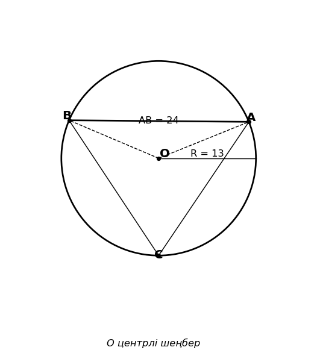

# Exam Question — MATH / Level B

| Field | Value |
|---|---|
| **ID** | `5b03def1-4174-4c8c-b3fc-3b43863939ea` |
| **Subject** | math |
| **Level** | B |
| **Format** | image |
| **Topic** | polygons_circles |
| **Generated** | 2026-06-02T18:22:08.604930+00:00 |
| **Attempts** | 1 |

## Figure

## Question

Суреттегі мәліметтерді пайдаланып, шеңберге іштей сызылған $ACB$ бұрышының косинусын табыңыз.

## Options

- **A)** $\frac{12}{13}$
- **B)** $-\frac{5}{13}$
- **C)** $\frac{5}{13}$ ✓
- **D)** $\frac{10}{13}$

## Correct Answer

**C**

## Explanation

1. Синустар теоремасының салдары бойынша, шеңберге іштей сызылған бұрыш пен оған қарсы жатқан хорда үшін $AB = 2R \sin(\angle ACB)$ теңдігі орындалады.
2. Суретте берілген $R = 13$ және $AB = 24$ мәндерін формулаға қоямыз: $24 = 2 \cdot 13 \cdot \sin(\angle ACB)$.
3. Бұдан $\sin(\angle ACB) = \frac{24}{26} = \frac{12}{13}$ екенін табамыз.
4. Суреттен $C$ төбесі үлкен доғада орналасқанын байқаймыз, яғни $\angle ACB$ — сүйір бұрыш. Сондықтан оның косинусы оң мәнге ие болады.
5. Негізгі тригонометриялық тепе-теңдікті қолданамыз: $\cos(\angle ACB) = \sqrt{1 - \sin^2(\angle ACB)} = \sqrt{1 - \left(\frac{12}{13}\right)^2} = \sqrt{1 - \frac{144}{169}} = \sqrt{\frac{25}{169}} = \frac{5}{13}$.

## Key Formulas

$$
AB = 2R \sin(\angle ACB)
$$

$$
\cos(\angle ACB) = \sqrt{1 - \sin^2(\angle ACB)}
$$

## Critic Evaluation

**Overall score:** 9.4/10 — PASS

| Dimension | Score |
|---|---|
| Correctness | 10.0/10 |
| Distractor quality | 8.667/10 |
| Difficulty alignment | 9.0/10 |
| Kazakh language | 9.167/10 |
| LaTeX validity | 9.667/10 |
| Figure relevance | 9.667/10 |

**Comments:** [openai/gpt-5.5] The keyed answer is correct and uniquely follows from the chord-radius relation and the inscribed angle theorem. The item is appropriate for level B, though one distractor is less clearly tied to a common error and the Kazakh phrasing could be slightly more standard by explicitly using ∠ACB. | [anthropic/claude-sonnet-4.6] The question is mathematically sound and correctly keyed. The figure clearly shows R=13, AB=24, and point C on the major arc, making the problem well-defined. All four distractors correspond to identifiable errors: A) confusing sin with cos, B) assuming obtuse angle (negative cosine), D) a plausible but incorrect arithmetic path. | [google/gemini-3.1-pro-preview] The question is excellently crafted. It requires multiple logical steps: applying the extended Law of Sines (or central/inscribed angle properties), calculating the trigonometric values, and crucially, using the visual information from the figure to determine the sign of the cosine (acute vs. obtuse angle). The distractors are highly plausible and target specific common errors.

### Critic's Independent Solution

[openai/gpt-5.5] answered C: The circle has center O and radius R = 13. The chord length is AB = 24. Let theta = angle AOB be the central angle subtending chord AB, and let alpha = angle ACB be the inscribed angle subtending the same chord AB. For a chord, AB = 2R sin(theta/2). Substituting the given values: 24 = 2*13*sin(theta/2) = 26*sin(theta/2). Therefore sin(theta/2) = 24/26 = 12/13. Since theta/2 is an acute angle in th

[anthropic/claude-sonnet-4.6] answered C: From the figure: circle with center O, radius R = 13, chord AB = 24. Point C is on the circle, and angle ACB is an inscribed angle subtending arc AB.

Since AB = 24 and R = 13, I need to find the inscribed angle ACB.

First, find the central angle AOB subtending chord AB.
Using the relationship: chord length = 2R·sin(θ/2), where θ is the central angle.
24 = 2·13·sin(θ/2)
24 = 26·sin(θ/2)
sin(θ/2) 

[google/gemini-3.1-pro-preview] answered C: 1. Identify the relationship between the inscribed angle and the central angle. The angle $\angle ACB$ is an inscribed angle that subtends the minor arc $AB$. We know it subtends the minor arc because point $C$ is located on the major arc (the center $O$ is between the chord $AB$ and point $C$, as shown in the diagram).
2. The measure of an inscribed angle is half the measure of the central angle 

**Critic's answer:** C
