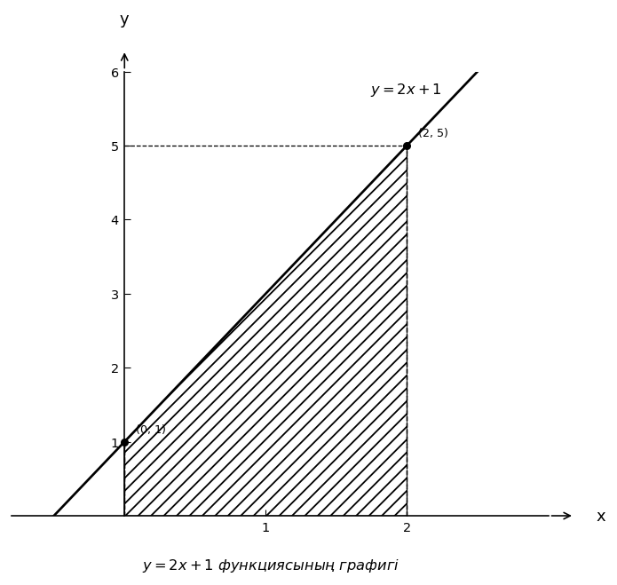

# Exam Question — MATH / Level A

| Field | Value |
|---|---|
| **ID** | `85f933e4-2ca8-46d8-a4ba-6963c16b72fc` |
| **Subject** | math |
| **Level** | A |
| **Format** | image |
| **Topic** | integrals |
| **Generated** | 2026-06-02T17:56:38.660168+00:00 |
| **Attempts** | 1 |

## Figure

## Question

Суреттегі боялған аймақтың ауданын табыңыз.

## Options

- **A)** $4$
- **B)** $5$
- **C)** $6$ ✓
- **D)** $8$

## Correct Answer

**C**

## Explanation

Суреттен боялған аймақ $y=2x+1$ графигінің астында, $x=0$ мен $x=2$ аралығында орналасқанын көреміз. Аудан анықталған интеграл арқылы табылады: $S=\int_{0}^{2}(2x+1)\,dx$. Алғашқы функциясы: $\int(2x+1)\,dx=x^2+x$. Енді Ньютон-Лейбниц формуласы бойынша: $S=(x^2+x)\big|_{0}^{2}=(2^2+2)-(0^2+0)=6$. Демек, боялған аймақтың ауданы $6$-ға тең.

## Key Formulas

$$
$S=\int_{a}^{b} f(x)\,dx$
$$

$$
$\int (2x+1)\,dx=x^2+x$
$$

$$
$\int_{0}^{2}(2x+1)\,dx=6$
$$

## Critic Evaluation

**Overall score:** 9.4/10 — PASS

| Dimension | Score |
|---|---|
| Correctness | 10.0/10 |
| Distractor quality | 8.0/10 |
| Difficulty alignment | 9.167/10 |
| Kazakh language | 9.667/10 |
| LaTeX validity | 10.0/10 |
| Figure relevance | 9.333/10 |

**Comments:** [openai/gpt-5.5] The keyed answer is correct and the figure clearly defines the shaded region as the area under y=2x+1 from x=0 to x=2. The item is appropriate for basic integral application, though the distractors are only moderately diagnostic. | [anthropic/claude-sonnet-4.6] The question is mathematically correct, well-illustrated, and appropriately aligned with Level A difficulty. The figure clearly shows the shaded region under y=2x+1 from x=0 to x=2, and the correct answer of 6 is verified. Distractors (4, 5, 8) are plausible — 4 could come from forgetting the +1 term, 5 from a geometric trapezoid miscalculation, and 8 from doubling an error. | [google/gemini-3.1-pro-preview] The question is perfectly designed for Level A. The figure is clear and essential, the distractors correspond to common student errors (e.g., integrating 2x+1 as x^2+2x gives 8, or calculating only the triangle area gives 4), and the language is accurate.

### Critic's Independent Solution

[openai/gpt-5.5] answered C: The shaded region is bounded below by the x-axis, above by the line y = 2x + 1, and vertically between x = 0 and x = 2. Therefore its area is the definite integral of the function from 0 to 2: Area = ∫_0^2 (2x + 1) dx. Compute the antiderivative: ∫(2x + 1) dx = x^2 + x. Evaluate from 0 to 2: (2^2 + 2) - (0^2 + 0) = (4 + 2) - 0 = 6. Thus the shaded area is 6.

[anthropic/claude-sonnet-4.6] answered C: From the figure, the shaded region is bounded by the line y = 2x + 1, the x-axis (y = 0), and the vertical lines x = 0 and x = 2. The shaded area is the area under the curve y = 2x + 1 from x = 0 to x = 2.

Area = ∫₀² (2x + 1) dx
= [x² + x]₀²
= (4 + 2) - (0 + 0)
= 6

So the area of the shaded region is 6.

[google/gemini-3.1-pro-preview] answered C: The image shows a shaded region bounded by the line $y = 2x + 1$, the x-axis ($y = 0$), the y-axis ($x = 0$), and the vertical line $x = 2$. 

To find the area of this region, we can use a definite integral. The area $A$ is given by the integral of the function from $x = 0$ to $x = 2$:
$$A = \int_{0}^{2} (2x + 1) \, dx$$

First, we find the antiderivative of $2x + 1$:
$$\int (2x + 1) \, dx = x^2 +

**Critic's answer:** C
