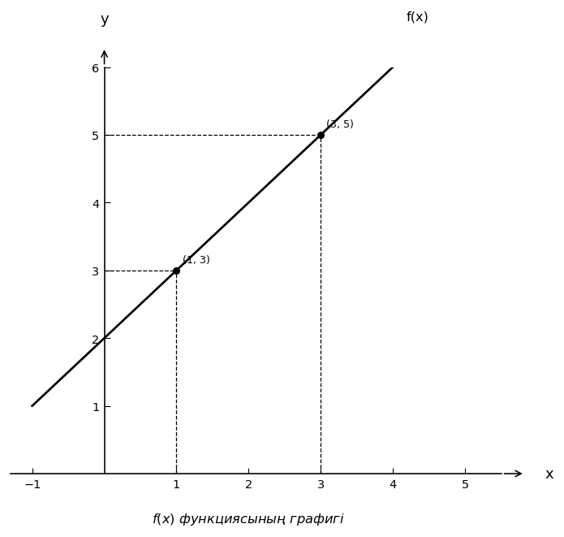

# Exam Question — MATH / Level B

| Field | Value |
|---|---|
| **ID** | `3b0e0374-5447-4507-8af0-4327793e8d10` |
| **Subject** | math |
| **Level** | B |
| **Format** | image |
| **Topic** | functions_limits |
| **Generated** | 2026-06-02T18:13:41.732266+00:00 |
| **Attempts** | 1 |

## Figure

## Question

Суреттегі $f(x)$ функциясының графигі бойынша $L=\lim_{x\to 2} f(x)$ болса, $\lim_{x\to 2}\frac{f(x)-L}{x-2}$ мәнін табыңыз.

## Options

- **A)** $0$
- **B)** $2$
- **C)** $1$ ✓
- **D)** Шек жоқ

## Correct Answer

**C**

## Explanation

Суреттен $x=2$ маңында график бір түзу бойымен өтетінін көреміз. Белгіленген нүктелер арқылы осы түзудің көлбеуін табамыз: $k=\frac{5-3}{3-1}=\frac{2}{2}=1$. Сонымен қатар график бойынша $x\to 2$ кезінде функция мәндері $L=\lim_{x\to 2}f(x)=4$ санына ұмтылады. Сондықтан $\lim_{x\to 2}\frac{f(x)-L}{x-2}$ осы түзу графигінің көлбеуіне тең: $\lim_{x\to 2}\frac{f(x)-4}{x-2}=1$. Дұрыс жауап: $1$.

## Key Formulas

$$
$L=\lim_{x\to 2} f(x)$
$$

$$
$\lim_{x\to 2}\frac{f(x)-L}{x-2}$
$$

$$
$k=\frac{y_2-y_1}{x_2-x_1}$
$$

## Critic Evaluation

**Overall score:** 9.2/10 — PASS

| Dimension | Score |
|---|---|
| Correctness | 9.667/10 |
| Distractor quality | 8.333/10 |
| Difficulty alignment | 8.833/10 |
| Kazakh language | 9.0/10 |
| LaTeX validity | 9.667/10 |
| Figure relevance | 9.667/10 |

**Comments:** [openai/gpt-5.5] The keyed answer is correct and uniquely determined from the graph: the required limit equals the slope of the line near x=2, which is 1. The item is clear and the figure is relevant, though the task is on the easier side of level B. | [anthropic/claude-sonnet-4.6] The question is well-constructed: the graph clearly shows a linear function through (1,3) and (3,5), the limit L=4 is correctly identified, and the derivative interpretation yields slope=1 as the answer. All distractors are reachable via plausible errors (e.g., D for thinking the limit DNE, B for computing slope incorrectly, A for thinking f(x)-L→0 implies the ratio→0). The figure is essential and accurate. | [google/gemini-3.1-pro-preview] The question is excellent. It elegantly tests the understanding of the limit definition of a derivative (or the ability to derive a linear function from a graph and evaluate a limit) using a clear and essential figure.

### Critic's Independent Solution

[openai/gpt-5.5] answered C: From the graph, f(x) is a straight line passing through the points (1, 3) and (3, 5). Its slope is (5 - 3)/(3 - 1) = 2/2 = 1. Therefore the line has equation f(x) = x + 2, since at x = 1, f(1) = 3. First, L = lim_{x -> 2} f(x) = 2 + 2 = 4. Now compute the required limit: lim_{x -> 2} (f(x) - L)/(x - 2) = lim_{x -> 2} ((x + 2) - 4)/(x - 2) = lim_{x -> 2} (x - 2)/(x - 2) = lim_{x -> 2} 1 = 1. Thus t

[anthropic/claude-sonnet-4.6] answered C: From the graph, f(x) is a linear function passing through points (1, 3) and (3, 5). The slope is (5-3)/(3-1) = 2/2 = 1. So f(x) = x + 2.

Step 1: Find L = lim_{x→2} f(x). Since f(x) = x + 2 is continuous, L = f(2) = 2 + 2 = 4.

Step 2: Compute lim_{x→2} [f(x) - L] / (x - 2) = lim_{x→2} [(x + 2) - 4] / (x - 2) = lim_{x→2} (x - 2) / (x - 2) = lim_{x→2} 1 = 1.

This limit equals 1, which corresponds 

[google/gemini-3.1-pro-preview] answered C: 1. First, we determine the equation of the function $f(x)$ from its graph. The graph is a straight line passing through the points $(1, 3)$ and $(3, 5)$.
2. We calculate the slope (derivative) of this line: $m = \frac{y_2 - y_1}{x_2 - x_1} = \frac{5 - 3}{3 - 1} = \frac{2}{2} = 1$.
3. Using the point-slope form, the equation of the line is $y - 3 = 1(x - 1)$, which simplifies to $f(x) = x + 2$.
4. 

**Critic's answer:** C
