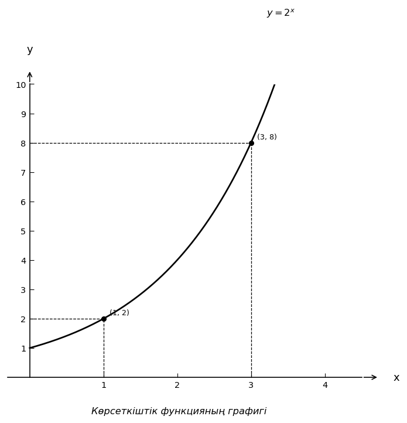

# Exam Question — MATH / Level B

| Field | Value |
|---|---|
| **ID** | `01830fe9-dd3c-48a6-a573-67ccff7fe5cc` |
| **Subject** | math |
| **Level** | B |
| **Format** | image |
| **Topic** | exponential_log_equations |
| **Generated** | 2026-06-02T18:14:52.628646+00:00 |
| **Attempts** | 1 |

## Figure

## Question

Суреттегі $y=2^x$ функциясының графигінде белгіленген сол жақ нүктенің ординатасын $b$, оң жақ нүктенің ординатасын $a$ деп алыңыз. $\log_b(x-1)=\log_b a-1$ теңдеуінің түбірін табыңыз.

## Options

- **A)** $4$
- **B)** $3$
- **C)** $5$ ✓
- **D)** $9$

## Correct Answer

**C**

## Explanation

Суреттегі белгіленген нүктелердің ординаталары бойынша $b=2$, $a=8$ екенін аламыз. Теңдеудің анықталу облысы: $x-1>0$, яғни $x>1$. Енді теңдеуді шешеміз: $\log_2(x-1)=\log_2 8-1$. Себебі $\log_2 8=3$, онда $\log_2(x-1)=2$. Логарифм анықтамасы бойынша $x-1=2^2=4$. Сондықтан $x=5$. Бұл мән анықталу облысына жатады, демек дұрыс жауап: $5$.

## Key Formulas

$$
$\log_b(x-1)=\log_b a-1$
$$

$$
$\log_2 8=3$
$$

$$
$\log_2(x-1)=2 \Rightarrow x-1=2^2$
$$

## Critic Evaluation

**Overall score:** 9.3/10 — PASS

| Dimension | Score |
|---|---|
| Correctness | 10.0/10 |
| Distractor quality | 8.333/10 |
| Difficulty alignment | 8.833/10 |
| Kazakh language | 9.0/10 |
| LaTeX validity | 9.667/10 |
| Figure relevance | 9.667/10 |

**Comments:** [openai/gpt-5.5] The keyed answer is correct and the figure clearly provides the needed ordinates b=2 and a=8. The item is concise and solvable in a clear multi-step process, though the mathematical demand is on the easier side of level B. | [anthropic/claude-sonnet-4.6] The question is mathematically sound, correctly keyed (x=5), and the figure clearly shows the two labeled points (1,2) and (3,8) needed to extract b=2 and a=8. Distractors are plausible: A=4 (forgetting to add 1), B=3 (stopping at x-1=2^2 without adding 1 or misreading log step), D=9 (possible if student uses x-1=2^3 directly). Kazakh phrasing is natural and terminology is appropriate. | [google/gemini-3.1-pro-preview] The question is well-designed, accurately testing the ability to extract information from a graph and solve a logarithmic equation. The distractors represent common student errors.

### Critic's Independent Solution

[openai/gpt-5.5] answered C: From the graph of y = 2^x, the left marked point is (1, 2), so its ordinate is b = 2. The right marked point is (3, 8), so its ordinate is a = 8. The equation is log_b(x - 1) = log_b a - 1. Substituting b = 2 and a = 8 gives log_2(x - 1) = log_2 8 - 1. Since log_2 8 = 3, we get log_2(x - 1) = 3 - 1 = 2. Therefore x - 1 = 2^2 = 4, so x = 5. This corresponds to option C.

[anthropic/claude-sonnet-4.6] answered C: From the graph, the two marked points on y = 2^x are (1, 2) and (3, 8). The left point is (1, 2) with ordinate b = 2, and the right point is (3, 8) with ordinate a = 8.

Now solve the equation: log_b(x - 1) = log_b(a) - 1
Substituting b = 2 and a = 8:
log_2(x - 1) = log_2(8) - 1
log_2(x - 1) = 3 - 1
log_2(x - 1) = 2
x - 1 = 2^2 = 4
x = 5

Check domain: x - 1 = 4 > 0 ✓

The answer is x = 5.

[google/gemini-3.1-pro-preview] answered C: Based on the provided graph of the function $y = 2^x$, we can identify the coordinates of the two marked points. The left point is at $(1, 2)$ and the right point is at $(3, 8)$. 

The problem states that $b$ is the ordinate (y-coordinate) of the left point, so $b = 2$. 
It also states that $a$ is the ordinate (y-coordinate) of the right point, so $a = 8$.

Now, we substitute these values into the

**Critic's answer:** C
